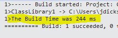
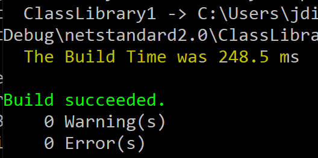

# Dotnet Build Metrics

MS Build task library compatible with MSBuild and dotnet core CLI.

Designed to collect compile time metrics from developers local workstation and log for later analysis of Time to Dev Feedback.  
**_It collects username and hostname as a part of build information_**
```
{
                    "id": "026fe42b-7888-4a76-81ee-2ab431ae4987",
                    "userName": "aanand",
                    "cpuCount": 12,
                    "hostname": "25BVM13",
                    "platform": 2,
                    "os": "Microsoft Windows NT 10.0.19042.0",
                    "timeTaken": "453",
                    "branch": "master",
                    "type": ".Net",
                    "projectName": "Agoda.Cronos.Accommodation",
                    "repository": "git@github.xxxx.io:front-end/dotnet-build-metrics.git",
                    "date": "2021-06-28T02:53:22.1420552Z"
 }
```
To use the task simply add the `Agoda.Builds.Metrics` as a dependency to your projects. Then you need to add the following line to your `.csproj` file ...

```
<Import 
  Project="$(MSBuildThisFileDirectory)\..\packages\agoda.builds.metrics\1.0.6\build\Agoda.Builds.Metrics.targets" 
  Condition="Exists('$(MSBuildThisFileDirectory)\..\packages\agoda.builds.metrics\1.0.6\build\Agoda.Builds.Metrics.targets')"
/>
```
ElasticSearcj URl and the INdex name are picked from the Environment variable , if doesnot exist fallback is `http://backend-elasticsearch:9200` and index `build-metrics`
```
string uriString = !string.IsNullOrEmpty(Environment.GetEnvironmentVariable("url")) ? Environment.GetEnvironmentVariable("url") : "http://backend-elasticsearch:9200";
string index = !string.IsNullOrEmpty(Environment.GetEnvironmentVariable("index")) ? Environment.GetEnvironmentVariable("index") : "build-metrics";
 ```
Note that the version number is embedded in the path, if you upgrade the library you have to update all of the project files as well.

Grafana dashboard for data visualization:
http://grafana.agoda.local/d/bUtx5Zk7k/net-local-build-analysis?orgId=1&refresh=5s


Example in Visual Studio using MSBuild.



Exmaple in Dotnet core CLI.



